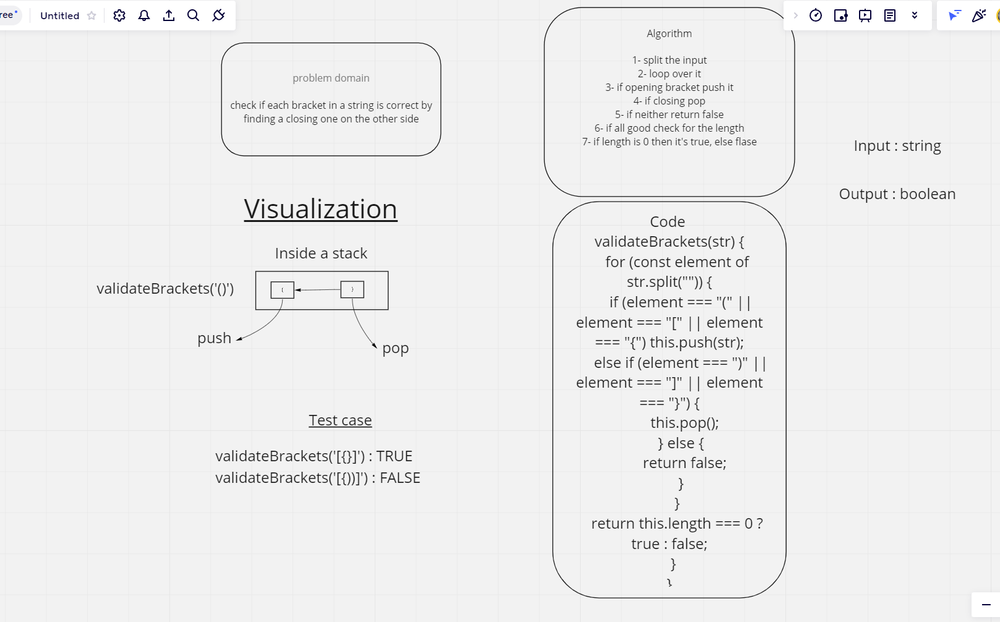

# Stacks and Queues

In stacks we deal with the top node only, in queue we use enqueue and dequeue which works from the front only

## Challenge

make a method to check if the brackets entered are correct and can work properly

## Approach & Efficiency

Time : O(n)

Space : O(n)

## API

push : to add the element into the stack
pop : to remove the last added element from the stack

## WhiteBoard

