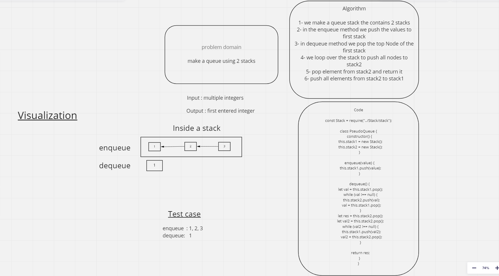

# Stacks and Queues

In stacks we deal with the top node only, in queue we use enqueue and dequeue which works from the front only

## Challenge

Need to make a queue out of 2 stacks

## Approach & Efficiency

Big O for time is O(n^2) since we loop twice
O(n) for space

## API

enqueue : adds an element into the queue, which runs the push method in the stack that adds an element to the stack

dequeue : removes an element from the queue which runs the pop method in the stack that removes the top element

## WhiteBoard

## Tests

jesos: path: /home/jesos/data-structures-and-algorithms/javascript | 15 files | size 520Kb | branch: [stack-queue-pseudo !?] |
└─ $~ npm run test stack-queue-pseudo

> data-structures-and-algorithms@1.0.0 test
> jest --verbose --coverage "stack-queue-pseudo"

PASS Stack-Queue/Stack-Queue-Pseudo/**test**/stack-queue-pseudo.test.js
Queue Pseudo Test
✓ Can successfully enqueue into a queue (2 ms)
✓ Can successfully enqueue multiple values into a queue
✓ Can successfully empty a queue after multiple dequeues (1 ms)
✓ Dequeue empty stack returns null
✓ Calling dequeue or peek on empty queue raises exception (1 ms)
