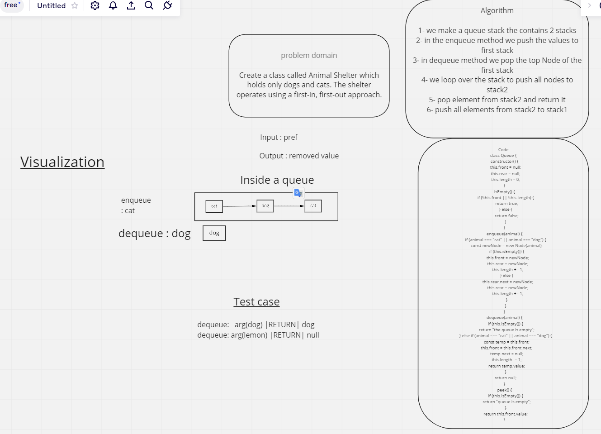

# Stacks and Queues

In stacks we deal with the top node only, in queue we use enqueue and dequeue which works from the front only

## Challenge

Need to make a class to enqueue a node and dequeue a cat or dog and return null or the object we asked for

## API

enqueue : adds an element into the queue, which runs the push method in the stack that adds an element to the stack

dequeue : removes an element from the queue which runs the pop method in the stack that removes the top element

## WhiteBoard

## Approach & Efficiency

Time : O(1)

Space : O(n)
