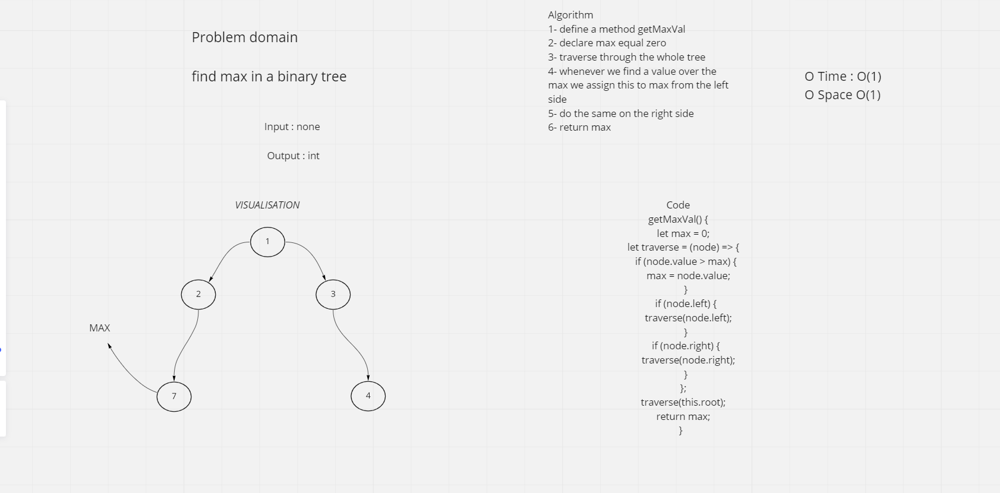

# Trees

## Binary Search Tree

Create a Binary Search Tree class
This class should be a sub-class (or your languages equivalent) of the Binary Tree Class, with the following additional methods:
Add
Arguments: value
Return: nothing
Adds a new node with that value in the correct location in the binary search tree.

## Node

Create a Node class that has properties for the value stored in the node, the left child node, and the right child node.

## WB

## API

- Traverse

## Big O

- O(1) space
- O(1) Time

## Tests

✓ can return max val (1 ms)
