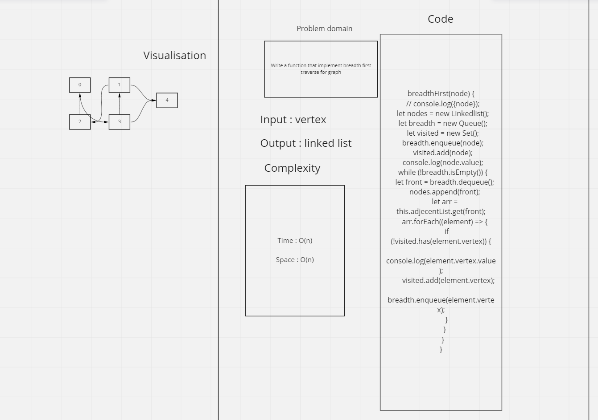

# Breadth first traverse for graph

Write a function that implement breadth first traverse for graph

input: vertex

output: linked list

# Approach & Efficiency

O(n) space efficiency

O(n) time efficiency

# Solution

node graph.js

# Whiteboard

