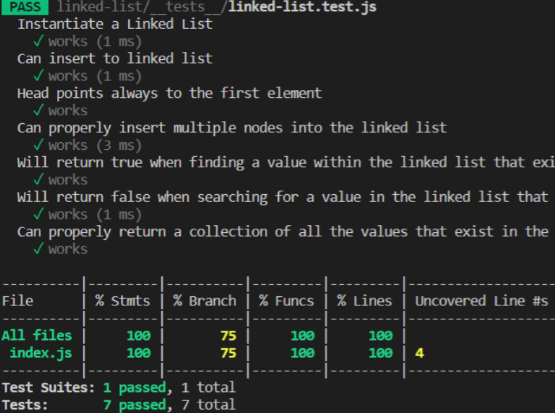

# Linked List

#### Linked list is a data structre that has similarities with arrays but elements are not stored at a contiguous location, the elements are linked using pointers.

# Challenge

#### Create a Node class that has properties for the value stored in the Node, and a pointer to the next Node and create a linked list class and a head property.

# Big(O)

- Insert O(1)

- Include O(n)

-toString O(n)

# Test pic

